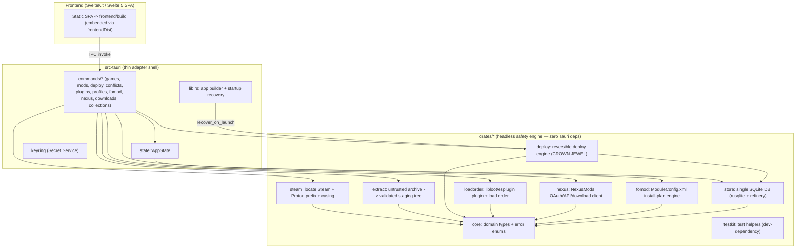

<!-- generated-by: gsd-doc-writer -->

# Architecture

## System Overview

NexTwist is a Rust + Tauri v2 desktop application that brings safe, fully-reversible
mod management to Linux gamers running Windows games (Skyrim Special Edition and
Fallout 4) via Steam Proton/Wine. It downloads and installs individual mods and curated
NexusMods Collections, resolves FOMOD installers, manages plugin load order via LOOT,
and deploys mods into a game's `Data/` tree **without ever modifying an original game
file in place**. The defining guarantee that overrides everything else: deployment is
**non-destructive** (the base game is never modified in place), **fully reversible** (a
purge restores a byte-for-byte pristine game), and **conflict-aware** (the user controls
which mods overwrite which files).

The architectural style is a **headless safety engine + thin adapter shell**: the entire
safety-critical engine is pure, headless Rust organized as a cargo workspace of `crates/*`
members with **zero Tauri dependencies**, and the Tauri shell (`src-tauri/`) is a thin
IPC-adapter layer that delegates to those crates and adds no logic. The frontend is a
SvelteKit (Svelte 5) static SPA embedded by Tauri. The input is an untrusted mod archive
(or a NexusMods download); the output is a reversibly-deployed game `Data/` directory plus
a persisted SQLite ledger that makes uninstall safe.

## The Headless-Engine / Thin-Adapter Boundary

The single most important structural decision in the codebase:

> The entire safety-critical engine lives in `crates/*` as pure, headless Rust with **zero
> Tauri dependencies**. The Tauri shell (`src-tauri/`) is a thin adapter that delegates to
> those crates and **adds no logic**.

This keeps the engine unit- and property-testable in CI without a webview. The headless
`crates/*` engine needs no system GUI libraries; only `src-tauri` requires the WebKitGTK
4.1 dev libs (because `src-tauri` is a workspace member, `cargo test --workspace` compiles
it and therefore needs those libs on the build host; the `crates/*` engine needs none).

The boundary is enforced in both directions:

- **Engine crates** use `thiserror` error enums and never pull in `tauri`. Errors only
  become `anyhow`/`String` at the app boundary.
- **Command adapters** (`src-tauri/src/commands/`) are documented as: lock the shared
  state, call **exactly one** headless-crate function, map the typed error to a `String`
  at the IPC boundary, and return. No business logic, no file loops, no path resolution
  lives there. The shared boundary error mapper is `commands::boundary_err`
  (`src-tauri/src/commands/mod.rs`).

Honor this boundary when extending the code: do not pull `tauri`/`reqwest`/UI concerns
into the `crates/*` engine, and do not put real logic in the command adapters.

## Component Diagram



Arrows indicate dependency / call-flow direction (A → B means A calls or depends on B).
`testkit` is a dev-dependency used by the engine test suites and is omitted from the call
edges above.

## Crate Layers

Each engine crate is published internally as `nextwist-<name>` and referenced by other
members via a workspace path alias (defined in the root `Cargo.toml`
`[workspace.dependencies]`).

| Crate | Alias | Responsibility |
|-------|-------|----------------|
| **core** | `nextwist_core` | Shared domain types (`Game`, `ManagedMod`, `Profile`, `Collection`, `Plugin`, `FileEntry`, `DeployMethod`, …) and error enums (`CoreError`, `StoreError`). Pure data, no I/O-framework deps — the vocabulary every other crate speaks. Aliased `nextwist_core` (never `core`, which would shadow std `::core` that Tauri macros expand to). |
| **store** | `nextwist_store` | The single SQLite database (rusqlite bundled + refinery migrations). Holds the game registry, the per-file deploy manifest, the operation journal, the vanilla backup ledger, and the mod/profile/plugin tables. **Hard invariant: no `rusqlite` type appears in its public API** — all SQL stays inside `store`; callers speak `core` types plus the small journal value types (`JournalId`, `JournalRow`, `OpIntent`). |
| **steam** | `nextwist_steam` | Quarantines all Steam/Proton-layout knowledge: locate Steam across native + Flatpak roots, resolve the install dir and Proton prefix (`compatdata/<appid>/pfx`, which `steamlocate` does not expose), and produce the per-game canonical `Data/` casing map (`casing.rs`) the deploy engine uses to normalize mixed-case paths under Wine. Accepts only the two supported AppIDs: Skyrim SE (489830) and Fallout 4 (377160). |
| **extract** | `nextwist_extract` | The untrusted-archive → validated read-only staging-tree transform (zip + 7z + shell-out RAR). Routes every entry through `validate::validate_entry`: rejects symlink entries (CVE-2025-29787 write-through), absolute paths, and parent-directory escapes (zip-slip). Extracts into a temp dir, then moves the validated tree into the staging root and marks it read-only. |
| **deploy** | `nextwist_deploy` | **The crown jewel — the reversible deployment engine.** Per-target FS capability probe (`probe.rs`) → the `reflink → hardlink → symlink → copy` method ladder (`method/`) with EXDEV/`CrossesDevices` fallback, conflict resolution by mod rank (`conflict.rs`), byte-for-byte pristine purge, plus profile switching (`profile.rs`) and verify/repair (`verify.rs`). |
| **loadorder** | `nextwist_loadorder` | Headless plugin / load-order management via `libloot`/`esplugin`. Resolves the Proton-prefix AppData location, scans/classifies plugins (`scan.rs`), fetches and applies the LOOT masterlist sort (`loot.rs`, `masterlist.rs`), and round-trips the asterisk-format `plugins.txt`. Tauri-free; uses a blocking `reqwest` client so no async runtime is forced into the safety engine. |
| **nexus** | `nextwist_nexus` | Headless NexusMods client: OAuth2 + PKCE token exchange and API-key validation (`auth.rs`), hybrid REST v1 download-link + GraphQL v2 metadata (`client.rs`), streaming download (`download.rs`), the `governor` rate limiter with reactive `X-RL-*` backoff (`ratelimit.rs`), and Collection resolution/replay (`collection.rs`, `replay.rs`, `resolve.rs`). Tauri-free **and keyring-free** by design — the shell owns all OS integration and passes token values in. |
| **fomod** | `nextwist_fomod` | The headless FOMOD 5.x `ModuleConfig.xml` engine. A three-stage pure transform: `parse` (locate + deserialize the XML AST), `condition` (recursive composite-dependency evaluator over an accumulated flag set), `resolve` (the **pure dry-run** that returns an ordered file-install plan without writing to disk). Tauri-free, reqwest-free, keyring-free. |
| **testkit** | `nextwist_testkit` | Dev-dependency test helpers: fake game/staging-tree builders and blake3 byte-for-byte pristine-tree assertions used across the engine test suites. |

## Data Flow

A typical "install and deploy a mod" path moves through the system as follows:

1. The frontend SPA issues a Tauri IPC `invoke` (e.g. `install_archive`, then `deploy`).
   The shell's `invoke_handler` (`src-tauri/src/lib.rs`) routes it to a thin command
   adapter in `src-tauri/src/commands/`.
2. The adapter locks the shared `AppState` (a `tokio::sync::Mutex<AppState>`), looks up
   the managed game via `commands::require_game` (a single `store.get_game` read), and
   delegates to exactly one engine function.
3. **Extract** (`extract::install_archive`) detects the archive format by magic bytes,
   validates every entry against zip-slip / symlink-write-through, extracts into a temp
   dir, moves the validated tree into the per-mod staging root, and marks it read-only.
4. **Deploy** (`deploy::deploy`) probes the target filesystem capabilities, chooses the
   strongest deploy method via `choose_method` (reflink → hardlink → symlink → copy),
   and — for each file — records intent in the operation journal **before** the syscall,
   performs an idempotent file op, backs up any pre-existing vanilla file into a
   content-addressed store, records the deployed path in the per-file manifest, and flips
   the journal row to `done`.
5. The adapter maps any `thiserror` engine error to a `String` via `boundary_err` and
   returns the result across IPC to the SPA.

On uninstall, `deploy::purge` walks the per-file manifest in reverse, removes deployed
files idempotently, and restores backed-up vanilla files from the content-addressed
store, leaving the game folder byte-for-byte pristine.

## Crash-Safety Model (the central idea in `deploy`)

A filesystem syscall (`link`/`reflink`/`copy`) and the DB row recording it cannot be made
atomic together. So safety is **not** SQLite-WAL alone — it is an explicit
**intent-before-act operation journal**:

- Intent is written `pending` **before** the syscall (`store::Store::begin_op`, taking an
  `OpIntent`).
- The row is flipped to `done` **after** the syscall completes (`store::Store::mark_done`).
- File ops are **idempotent**, so replaying a half-finished op after a crash is always
  safe.

On launch, the shell calls `deploy::recover_on_launch` for **every** managed game **before
the UI is served**. This wiring lives in `src-tauri/src/lib.rs`: the `setup` closure runs
`recover_all_on_launch(&app_state)` (which iterates `store.list_managed_games()` and calls
`deploy::recover_on_launch` per game) **before** `app.manage(...)` makes state available to
any window. Pending journal rows (`store::Store::pending_ops`) are replayed to a consistent
state. Recovery failures are logged but never fatal — the app still opens so the user can
act.

When touching `deploy`, preserve the journal ordering and idempotency — it is the
reversibility guarantee.

## The Deploy Method Ladder

Per-target filesystem capabilities are detected at deploy time (`crates/deploy/src/probe.rs`
produces `FsCaps`), and the strongest available primitive is chosen by `choose_method`
(`crates/deploy/src/method/mod.rs`). The ladder, from strongest to fallback, maps to the
`core::DeployMethod` enum:

| Method | `DeployMethod` variant | Why |
|--------|------------------------|-----|
| Reflink | `Reflink` | Copy-on-write clone — instant, space-efficient, **independent inode** so edits to the deployed file cannot corrupt the staged copy. The safest primitive. |
| Hardlink | `Hardlink` | Same-inode link — instant and space-efficient, **same-device only**. The staged tree is marked read-only so a shared inode cannot be mutated. |
| Symlink | `Symlink` | Cross-device fallback (links cannot cross filesystem boundaries — e.g. a separate mods drive). |
| Copy | `Copy` | Last-resort byte copy. |

The fallback is triggered by `EXDEV` / `CrossesDevices` errors when a link cannot cross a
filesystem boundary. Each variant has a stable lowercase token (`reflink`/`hardlink`/
`symlink`/`copy`) used for DB persistence in the manifest and journal.

## Persistence and Migrations

`store` is the single SQLite file database (rusqlite with the `bundled` feature statically
links SQLite — no system dependency, keeping the AppImage self-contained). Schema evolution
uses versioned, additive refinery migrations in `crates/store/src/migrations/`:

- `V1__init.sql` — the reversible-deployment safety core: game registry, per-file deploy
  manifest, operation journal, and vanilla backup ledger.
- `V2__multi_mod.sql` — the multi-mod / profile / plugin substrate.
- `V3__profile_fks.sql` — profile foreign-key constraints.
- `V4__nexus_provenance.sql` — NexusMods provenance, added additively.
- `V5__collections.sql` — the Collection acquisition substrate, added additively.

> rusqlite is pinned to **0.39** (not 0.40): `refinery 0.9.2` caps its rusqlite feature
> there, and the two crates must agree on a single `libsqlite3-sys`.

## Tauri Shell (`src-tauri/`)

`lib.rs` builds the app, resolves the OS app-data dir (`resolve_data_dir`), runs startup
crash recovery, and registers the command adapters. It also wires the OS-integration
plugins in a load-bearing order: `tauri-plugin-single-instance` **before**
`tauri-plugin-deep-link`, so a second `nxm://` invocation (a browser "Mod Manager
Download" click while the app is open) is forwarded to the live instance and routed to
`on_open_url` rather than opening a duplicate window. The `nxm://` scheme is registered via
`register_all()`, and a non-fatal self-test (`nxm_self_test`) reports whether NexTwist is
the default handler.

Command adapters live in `src-tauri/src/commands/` — one module per domain: `games`,
`mods`, `deploy`, `conflicts`, `plugins`, `profiles`, `fomod`, `nexus`, `downloads`, and
`collections`. Each is thin: it locks `AppState` and calls into the engine crates. The
shell owns all OS integration the engine deliberately avoids — the keyring (Secret
Service, `keyring.rs`), `nxm://` deep-link registration/capture, single-instance
forwarding, and opening the system browser for OAuth.

The frontend is a SvelteKit (Svelte 5) app built as a static SPA into `frontend/build` and
embedded by Tauri via the `frontendDist` configuration.

## Directory Structure Rationale

The project is a virtual cargo workspace (no root crate). The split exists to keep the
safety-critical engine free of GUI/webview dependencies so it can be exhaustively tested
in CI without a desktop session.

```
NexTwist/
├── Cargo.toml            # virtual workspace manifest + pinned [workspace.dependencies]
├── crates/               # the headless safety engine (zero Tauri deps)
│   ├── core/             # shared domain types + error enums
│   ├── store/            # single SQLite DB (registry, manifest, journal, ledger, …)
│   ├── steam/            # Steam/Proton discovery + resolution + Wine casing
│   ├── extract/          # untrusted archive -> validated read-only staging tree
│   ├── deploy/           # the reversible deployment engine (CROWN JEWEL)
│   ├── loadorder/        # libloot/esplugin plugin + load-order management
│   ├── nexus/            # NexusMods OAuth/API/download client
│   ├── fomod/            # FOMOD ModuleConfig.xml install-plan engine
│   └── testkit/          # test helpers (dev-dependency)
├── src-tauri/            # the thin Tauri adapter shell (needs WebKitGTK 4.1)
│   └── src/
│       ├── lib.rs        # app builder + startup crash-recovery wiring
│       ├── state.rs      # AppState
│       ├── keyring.rs    # OS Secret Service integration
│       └── commands/     # thin per-domain IPC adapters
└── frontend/             # SvelteKit (Svelte 5) static SPA -> frontend/build
```

## Key Abstractions

The most significant exported abstractions, with their crate and file:

- **`deploy::deploy` / `deploy::purge` / `deploy::recover_on_launch`** — the deploy
  engine's orchestration entry points (`crates/deploy/src/engine.rs`).
- **`deploy::choose_method` + `core::DeployMethod`** — the reflink → hardlink → symlink →
  copy ladder (`crates/deploy/src/method/mod.rs`, `crates/core/src/model.rs`).
- **`store::Store`** — the single SQLite handle exposing the registry, manifest, journal,
  and ledger; no `rusqlite` type crosses its API (`crates/store/src/db.rs`).
- **`store::OpIntent` / `store::JournalRow` / `Store::begin_op` / `Store::mark_done` /
  `Store::pending_ops`** — the intent-before-act operation journal
  (`crates/store/src/journal.rs`).
- **`extract::install_archive` + `extract::validate_entry`** — the untrusted-archive →
  validated staging-tree transform with zip-slip/symlink defense
  (`crates/extract/src/staging.rs`, `crates/extract/src/validate.rs`).
- **`steam::resolve_game` + `steam::canonical_data_casing`** — Steam/Proton resolution and
  the Wine `Data/` casing map (`crates/steam/src/resolve.rs`, `crates/steam/src/casing.rs`).
- **`fomod::resolve` + `fomod::Selection` / `fomod::FileInstall`** — the pure FOMOD
  dry-run that produces an ordered file-install plan (`crates/fomod/src/resolve.rs`).
- **`nexus::NexusClient` + `nexus::resolve_collection`** — the NexusMods API client and
  Collection resolver (`crates/nexus/src/client.rs`, `crates/nexus/src/resolve.rs`).
- **`loadorder::scan_plugins` + `loadorder::propose_sort`** — plugin scan/classify and the
  LOOT sort proposal (`crates/loadorder/src/scan.rs`, `crates/loadorder/src/loot.rs`).
- **`core::Game` / `core::ManagedMod` / `core::Profile`** — the stable domain vocabulary
  every crate speaks (`crates/core/src/model.rs`).
